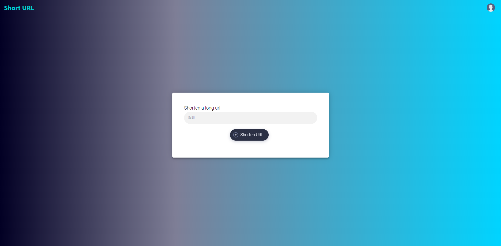
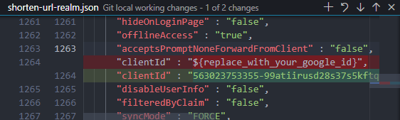
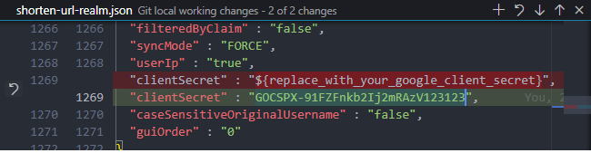

# Shorten URL - URL Shortening Service

<p align="center">
  <a href="./docs/shorturl-demo.mp4" target="_blank">
    
    <br>
    Live Demo
  </a>
</p>

<p align="center">An url shorten web service written by Nestjs and Angular.</p>

## Requisites
- Nodejs(20.14.0+)
- Docker & docker-compose

## Quick Start
1. clone this project
```
https://github.com/CobaltBlue3699/shorten-url.git
```
2. copy `.env.example` to `.env`  
3. create your own google oauth account, see <a href="https://developers.google.com/identity/protocols/oauth2?hl=zh-tw">this</a>  
4. modify `.env` to your own settings.  
5. enter your google client id and client secret to `apps/keycloak/shorten-url-realm.json`  
  
  
6. start relying party by using docker-compose
```
docker-compose up -d
```
7. run command `npm i` to install dependencies
8. run command `npm start:f` to start developing frontend project
8. run command `npm start:b` to start developing backend project  
10. open `http://{your localhost}:3000` with broswer, have fun
11. default Swagger API url is `http://0.0.0.0:3000/docs`

## TODOs
- [X] validate input url format
- [X] random generate string algorithm
- [ ] add unit test
- [ ] Backend
  - [X] integrate keycloak for Authentication and Authorization
  - [X] Swagger for api management  
  - [X] statistics short url request usage, etc country, device, daily count...  
    - [X] writting cron job to daily update ip geolocation  
    - [X] using redis to queueing api while gathering statistics (improve performance)  
  - [X] using redis to cache short url while url redirecting
  - [X] pagination urls api
  - [ ] custom short url  
  - [ ] SSL?  
  - [ ] Admin account?  
- [ ] Frontend  
  - [X] use chart.js to display statistics  
  - [X] virtual scrolling while rendering user's url  
  - [ ] qrcode support?  

## Reference
- [知乎-短 URL 系统是怎么设计的？](https://www.zhihu.com/question/29270034)
- [GitHub/Ourls](https://github.com/takashiki/Ourls)
