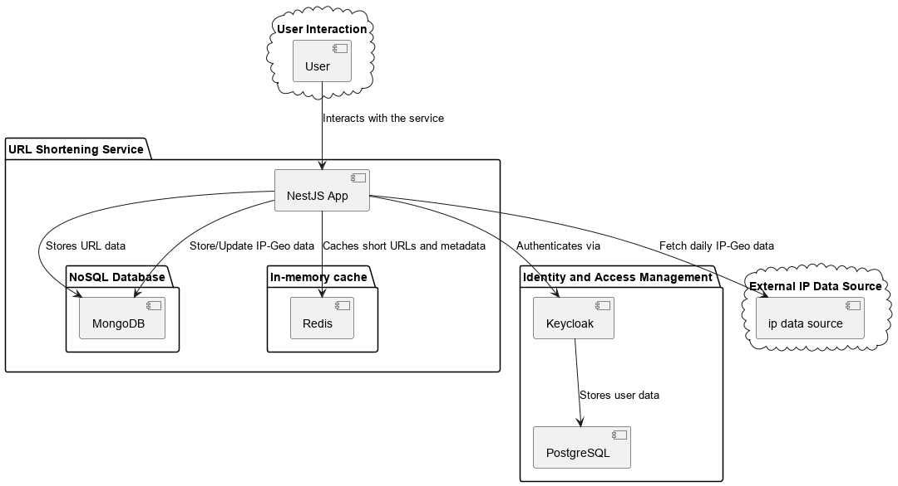
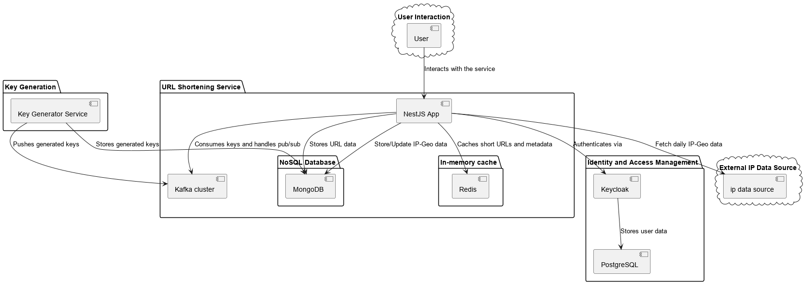

## Design Overview

### 需求定義
- 需要有會員系統，只有會員才可以使用功能。
- 使用者可以用網址來產生短網址，方便分享。
- 使用者可以管理自己產生的網址。
- 須具備高可用性，進行短網址轉導時越快越好。
- 需要統計短網址的使用情況，方便會員進行管理，也方便公司取得有用資料進行市場分析。
- 短網址存活時間： one month
- 短網址採用base62編碼，一個長度可以存放62種URL



### 設計思路
<hr />

##### Backend
這類應用的效能瓶頸通常在I/O情境中，所以選用NodeJs(NestJs)來開發伺服器。
Node.js 的 Event Loop 設計模式適合處理高並發和大量 I/O 的場景，這讓它成為這類應用的理想選擇。

<hr />

##### Key generations strategy

短網址長度計算：

1. 一個長網址預設500字元，也就是500bytes
2. 一個月預計有500萬的新URL資料
3. 500萬 / 62^5 ≒ 0.0054，代表key長度設置5碼對於目前需求是足夠的
4. 資料庫大小: 500萬 * 500 bytes

<hr />

##### 會員管理系統
會員管理系統使用了 Keycloak，它是一款強大且廣泛使用的開源軟體，提供身份管理和訪問管理功能。
Keycloak 簡化了用戶身份驗證和授權的實現，並且易於與現有的應用集成。

<hr />

##### Database
nosql or rdbms ?

1. 我們需要很多容量來存放資料。
2. 每個紀錄本身很小(<1KB)
3. 記錄跟紀錄之間沒有強大的關聯relationship 基本上不太需要join

基於以上需求，選擇了 NoSQL 的 MongoDB 來儲存資料。  
MongoDB 的靈活性和水平擴展性非常適合這種場景，尤其是當數據結構不需要複雜的關聯時。  

<hr />

##### Caches API
為了提升URL轉導的速度，需要有一個In-memory cache(Redis)    
Redis 提供了快速的讀寫能力，能夠顯著降低訪問延遲，特別是在頻繁查詢短網址的場景中。  

<hr />

##### Message Queue
轉導URL時需要進行資料統計，例如來源IP位置統計、URL被使用次數統計等等。
但為了高可用性需求，統計處理最好在背景執行。
這時候就需要Message Queue來幫忙。
目前採用Redis的pub/sub功能，來作為本專案的Message Queue。
優點：

- In-memory 響應速度快
- 架設方便
- 實作簡單

<hr />

##### 未來優化方向


1. 創建 Key Generator Service  
```

Key Generator Service，顧名思義，在背景產生unique key的service。
負責把沒使用過的unique key預先存放在mongodb。
成功存放後再把key存放在MQ裡面等待消費。

Key Generation動作拆解出來有以下好處。

． Nodejs不適合處理需要CPU運算的工作，把這部分工作分給golang或者Rust等語言，Node.js只負責其擅長的場景(I/O)，可以更妥善利用硬體資源。
． Key Generator在背景執行，代表user在作生成短網址操作的時候，實際上進行的是update而不是insert，這進一步提升系統效率。

```
2. Message Queue轉用kafka   
```

kafka允許橫向擴展，可以輕易吞吐數百萬條資料，相比Redis，kafka更適合資料量大的場景。
Redis把資料存放在記憶體的方式，雖然帶來了性能優勢，但也沒辦法支援太大的資料量。

```
